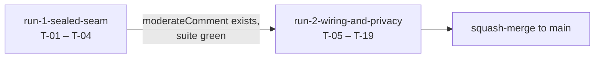

# Choreography: Feedback rudeness guardrail

Two runs, strictly sequential. Assessment and the reasoning behind the boundary are in
[split-assessment.md](./split-assessment.md).

## Run order

| # | Run | Tasks | Roles | Isolation |
|---|---|---|---|---|
| 1 | [run-1-sealed-seam](./run-1-sealed-seam/) | T-01 – T-04 | API integration, prompt hardening | Own git worktree — touches no file run 2 needs |
| 2 | [run-2-wiring-and-privacy](./run-2-wiring-and-privacy/) | T-05 – T-19 | Next.js route + client; privacy / data protection | Shared checkout, after run 1 has merged |

`work/` is a shared checkout across concurrent sessions. Run 1 must use a worktree, and
must copy `.env.local` into it.

## Artifact dependencies

| Artifact | Produced by | Consumed by |
|---|---|---|
| `src/lib/feedback-moderation.ts` — the `moderateComment` contract | Run 1, T-03 | Run 2, T-06 |
| The T-01 finding: which constrained-output mechanism `claude-haiku-4-5` accepts | Run 1, T-01 | design.md § Contracts — documentation only, run 2 does not branch on it |
| `ANTHROPIC_API_KEY` in `.env.production.example` | Run 1, T-02 | Run 2, T-16 (set the real value on Render) |

Run 2 depends on run 1 through **one function signature**. That narrowness is what
makes the boundary safe: if run 1's internals change, run 2 is unaffected.

## Handoff protocol

**Run 1 → run 2**

1. Run 1 executes `./run-1-sealed-seam/validate-exit.sh` from `work/`. It must print
   `ALL CHECKS PASSED`.
2. Run 1 commits and merges its branch into the feature branch. The suite is green at
   this point and must stay green until run 2's T-05.
3. Run 1 records the T-01 finding in design.md § Contracts, replacing the
   implementation-order note with the answer.
4. Run 2 begins by executing `./run-2-wiring-and-privacy/validate-exit.sh --entry`,
   which re-checks run 1's exit criteria rather than trusting the handoff.

**Run 2 → release**

Run 2 carries the release itself (T-16 – T-19). Two things in it are not code and
cannot be validated by script:

- **T-17 must happen before deploy, not after.** The notice bump re-prompts every
  returning visitor for consent (DEC-007), and the Chamber needs to know before they
  see the dip.
- **T-16 sets the key in the Render dashboard only.** It goes in no commit, no note,
  and no message.

## The red-suite window

From run 2's T-05 until its T-15, `src/lib/privacy/pii-inventory.test.ts` fails by
design. This is DEC-002's tripwire working, not a regression.

Rules for that window:

- **Do not merge to `main` inside it.** Run 2's exit is the first point after T-05 at
  which the tree is releasable.
- **Do not "fix" the coverage test.** It is telling the truth: the store gained an
  identifier and has no handlers yet. Silencing it removes the only thing enforcing
  the privacy work.
- Any *other* test failing in that window is a real regression and stops the run.

## Execution

Each run's tasks are executed with **implement-spec**, one task at a time, against that
run's `project-plan.md`. Sequencing between runs is the harness's job — do not hand-walk
this document by pasting prompts.
