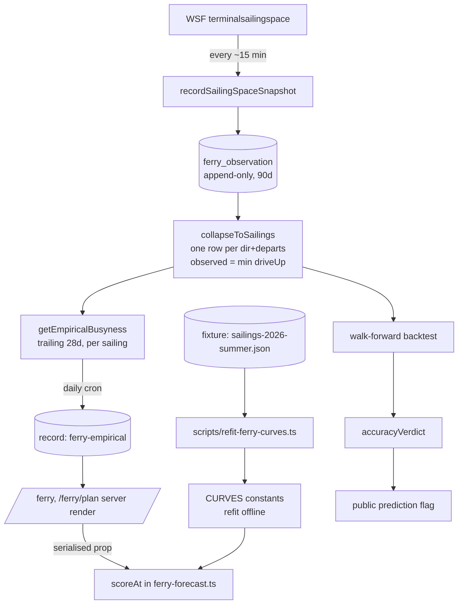
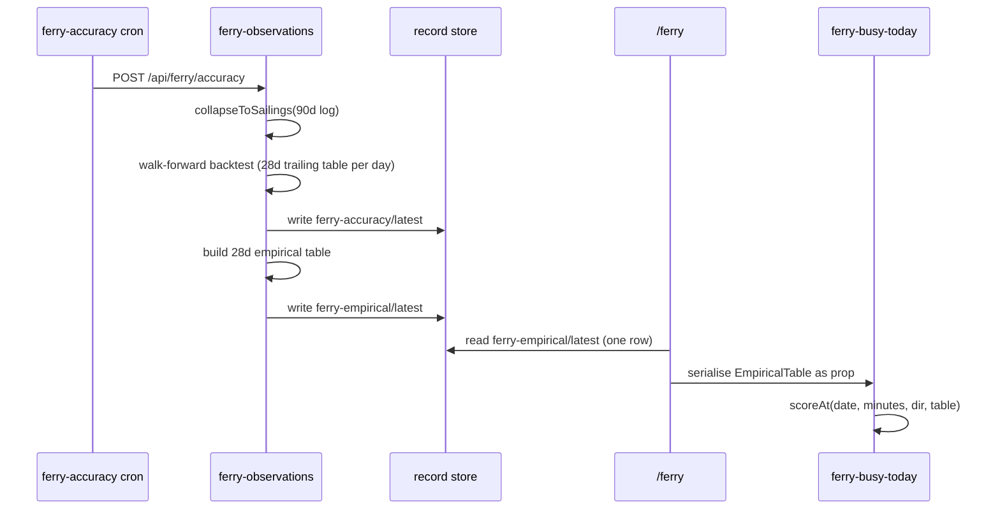

# Design: ferry forecast refit

## Context

The busyness forecast is three modules and one gate:

| Piece | File | Property that constrains this design |
|---|---|---|
| The model | `src/lib/ferry-forecast.ts` | **Pure and client-safe.** No fetch, no env, no server-only imports — the planner recomputes it in the browser as the visitor drags the time slider, and SSR/hydration must agree. |
| The log + learning + grading | `src/lib/stores/ferry-observations.ts` | Server-only. Writes snapshots, aggregates the empirical table **on the request path**, runs both backtests. |
| The readout | `src/lib/ferry-accuracy-verdict.ts` | Pure. Turns metrics into a go/no-go the Chamber can act on. |
| The gate | `prediction-control.tsx` → `ferry-prediction-store.ts` | Public flag, **currently OFF** (no record in prod; the store defaults to off). |

Data flows server → client as a serialised `EmpiricalTable` prop into
`ferry-planner.tsx` and `ferry-busy-today.tsx`. `line-lander.tsx` deliberately
skips it over scan cost.

Measured baseline and every number quoted below:
[../FERRY-FORECAST-ACCURACY-2026-08.md](../FERRY-FORECAST-ACCURACY-2026-08.md) —
25,454 snapshots, 2,156 sailings, 50 Pacific days, 2026-07-12 → 2026-08-23.

### The two defects

**1. The graded quantity is wrong.** WSF holds `DriveUpSpaceCount` at its
maximum until the boat is nearly loading. 57% of logged rows record an empty
deck, and each is graded as an independent observation of that sailing's
busyness. Mean observed fullness per snapshot is **21.3**; per sailing it is
**66.9**. The same per-snapshot average feeds `getEmpiricalBusyness()`, so the
live blend is currently taught that a peak Saturday 2 PM boat is ~21% full.

**2. The curves are barely informative.** Graded per sailing, the heuristic
scores MAE 28.1 against 25.4 for always guessing the mean. Pearson r is 0.45
overall and **0.30 eastbound**. Evenings are under-predicted by 20–28 points,
early mornings over-predicted by 13–26.

### The spike that shaped DEC-001

`driveUp` is effectively monotone non-increasing (44 of 2,156 sailings ever
increase by >2; none look like resets), and **70% of sailings reach their
fullest reading after the scheduled departure**, a mean of **+15.7 points**
above the best pre-departure reading — WSF keeps reporting while the boat
loads, and boats load late. Grading on the last pre-departure snapshot (the fix
sketched in [../CODE-REVIEW-2026-08.md](../CODE-REVIEW-2026-08.md)) leaves a
−11 bias. Truth must be the fullest state ever seen. See DEC-001.

## Approach

Option **C** of four considered: **refit the constants *and* make the observed
data primary.** Per DEC-001 the ground truth is `min(driveUp)` per sailing; per
DEC-004 a trailing observation window carries the season for buckets that have
data, while the refit constants carry it for buckets that do not.

The shape is a two-speed model:

- **Warm path** — a bucket with enough sailings behind it predicts from
  observation. Measured **MAE 10.6** on a trailing 28-day window, against a
  10.6-point within-bucket noise floor. There is no modelling headroom left.
- **Cold path** — an empty bucket, a fresh deploy, or a stalled cron falls back
  to `CURVES`. Today that path is worth MAE 28.1; refitting it makes it ~12.

Neither half is optional. A′ (refit only) rots by October and strands the
queue-sensing blend seam; B (data-first only) makes the *worst* path the one
visitors hit during an outage, on a cron that `render.yaml`'s own comments
record as having died silently before.

**Season lives on exactly one side of the blend.** A trailing window *is* a
season adjustment — a bucket learned from the last 28 days already knows what
month it is. Applying `seasonFactor` on top of that would count the season
twice. Per DEC-004, `seasonFactor` and the holiday factor apply to the
**heuristic term only, before the blend**; the empirical term is used as
observed. `empiricalBucketKey` is unchanged, so the golden-string contract and
every persisted key survive. The untested season constants stay confined to the
cold path, where they are the only thing we have — and T-10's staleness guard is
what stops that path quietly serving summer constants in December.

## Structure



The one structural change is `REC`: the empirical table stops being computed on
the request path and becomes a record the daily cron writes. That removes the
52k-row JS scan flagged high-severity in the code review, and it is what makes
a trailing window affordable.

## Key flows



## Contracts

**`SailingOutcome`** — the collapsed unit everything downstream grades and
learns from. Lives in `ferry-observations.ts` beside its callers, exported for
tests, following the existing `pacificParts` precedent.

```ts
interface SailingOutcome {
  dir: Direction;
  departs: string;   // ISO instant — identity with dir
  date: string;      // Pacific YYYY-MM-DD of departure
  minutes: number;   // Pacific minutes since midnight of departure
  observed: number;  // 0–100, fullest state ever seen (per DEC-001)
  snapshots: number; // rows collapsed into this outcome
  meanDelayMin: number | null;
}
```

**`EmpiricalBucket`** gains one field in phase 4; `n` changes meaning in phase 1
from snapshots to **sailings**, which is what `EMP_MIN_SAMPLES` and
`EMP_FULL_CONFIDENCE_N` always claimed to count.

```ts
interface EmpiricalBucket {
  s: number;      // mean observed fullness 0–100
  n: number;      // DISTINCT SAILINGS (was: snapshots)
  pFull?: number; // phase 4 — share of sailings in this bucket that hit >=99
}
```

**`record` store `ferry-empirical`, id `latest`** — new, written by the daily
cron, read by `/ferry` and `/ferry/plan`.

```ts
interface EmpiricalRecord {
  id: "latest";
  table: EmpiricalTable;
  windowDays: number;
  sailings: number;
  days: number;
  computedAt: string;
}
```

**`scoreAt` blend order** changes shape per DEC-004. Today the factors multiply
the curve and the result is blended. After phase 3:

```ts
const heuristic = clamp(base * seasonFactor(parts) * (holiday?.factor ?? 1));
const bucket = empirical?.[empiricalBucketKey(direction, dateStr, minutes)];
// season/holiday already spent on `heuristic`; `bucket.s` is used as observed
return bucket && bucket.n >= EMP_MIN_SAILINGS
  ? clamp(heuristic * (1 - w) + bucket.s * w)
  : heuristic;
```

**`AccuracyMetrics`** gains a `method` discriminator so the stored history does
not silently mix two incompatible measurement regimes (DEC-002), and per DEC-006
each run produces two numbers — the walk-forward blended metric that gates, and
the heuristic-only cold-path metric that is displayed and alarmed on but never
gates. Per DEC-007 both live in one history entry, and the shape lands once, in
phase 1:

```ts
interface AccuracyRecordEntry {
  method: "per-snapshot" | "per-sailing";
  coldPath: AccuracyMetrics;      // heuristic only — the fallback path
  walkForward?: AccuracyMetrics;  // blended, out-of-sample; absent before phase 3
  computedAt: string;
}
```

`accuracyVerdict()` reads `walkForward` and nothing else. `coldPath` is
displayed and alarmed on but never gates — so a fallback that quietly rots is
visible without being able to block or unblock the feature.

**Level thresholds.** `scoreToLevel` stops being a scale-shaped guess and
becomes a risk ladder (DEC-005): each cut sits where the measured chance of the
boat actually filling changes materially — 0% below 35, 5–10% in the middle, and
better-than-even above 92. Per DEC-009 the cuts are **35 / 50 / 80 / 92**, carrying measured fill risks of
0% / 0% / 5–10% / 31–50% / 57–70%.
Because the same cuts classify both prediction and outcome, moving them changes
`levelMatchRate` on both sides — which is why they are pinned once, before the
phase-2 exit measurement, and not tuned afterwards.

## Decision summary

| # | Decision | Where it shows up |
|---|---|---|
| DEC-001 | Ground truth per sailing | § The spike, § Contracts (`SailingOutcome.observed`), phase 1 |
| DEC-002 | Accuracy-history discontinuity | § Contracts (`AccuracyMetrics.method`), phase 1 |
| DEC-003 | Where the empirical table is computed | § Structure, § Key flows, phase 3 |
| DEC-004 | Season handling under a trailing window | § Approach, phase 2 and 3 |
| DEC-005 | Level thresholds | phase 2 |
| DEC-006 | Backtest split policy | § Key flows, § Contracts (`AccuracyMetrics`), phase 3 |
| DEC-007 | Shape holding both accuracy numbers | § Contracts (`AccuracyRecordEntry`) |
| DEC-008 | p(full) contract and surface | phase 4 |
| DEC-009 | Level cut points | § Contracts (level thresholds) |

## Testing strategy

| Level | Proves | Notes |
|---|---|---|
| Unit, pure (`ferry-forecast`) | Curve shape, blend gate, level edges, boarding-pass parity | The existing `ferry-model.test.ts` contracts stay binding — especially the `empiricalBucketKey` golden strings and the boarding-pass parity sweep, which is the documented drift trap. |
| Unit, mocked log (`ferry-observations`) | `collapseToSailings`, per-sailing aggregation, walk-forward backtest, daily-series fold-up | Follows the existing pattern in `ferry-daily-accuracy.test.ts`, which mocks the db append layer rather than needing Postgres. |
| Fixture regression | The refit reproduces its published metrics | A committed per-sailing fixture makes the fit reproducible in CI without prod access. |
| Not unit tested | The WSF feed's own semantics | Characterised once in the phase-1 investigation task and written down; we cannot test someone else's API from here. |
