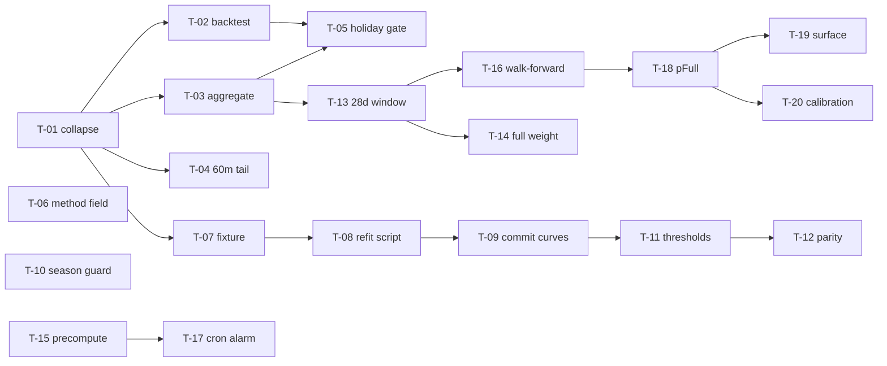

# Plan: ferry forecast refit

## Overview

Take the busyness forecast from a reported 32.5 MAE — most of it a grading
artifact — to the measured ~10.6 ceiling, so `accuracyVerdict()` returns
`ready` on evidence and the Chamber can flip the public prediction flag.
Architecture in [design.md](./design.md); the measurements every target below
is drawn from are in
[../FERRY-FORECAST-ACCURACY-2026-08.md](../FERRY-FORECAST-ACCURACY-2026-08.md).

Four phases, strictly sequenced: **measure honestly → refit the fallback →
make data primary → say what visitors actually asked.** Nothing in phases 1–3
changes what the public sees, because the feature ships dark.

## Scope

**In**: per-sailing grading and aggregation; refit `CURVES`; trailing-window
data-first blend; empirical table off the request path; re-derived level
thresholds; walk-forward backtest of the *shipped* model; probability-of-full.

**Out** (unchanged by this plan, and stated so no one assumes otherwise):

- Queue sensing — [../FERRY-QUEUE-SENSING.md](../FERRY-QUEUE-SENSING.md) is a
  separate plan. This work preserves the `scoreAt()` blend seam it depends on.
- `ARRIVE_EARLY_DRIVE` / `ARRIVE_EARLY_WALK` / `BOAT_WAIT` minute claims. They
  are research-derived and **this data cannot validate them** — deck fullness
  says nothing about how many boats you wait. They keep sitting on top of a now-
  measured busyness number, which is an improvement, not a validation.
- `seasonFactor` (0.82 / 0.58) and the holiday multipliers (1.2–1.5). All 50
  days are peak season and no holiday falls in the window. Phase 2 adds a guard
  instead of a refit — see DEC-004.
- **Deferred: narrowing the observation window** (change #9 of the evaluation's
  nine). Dropping snapshots >45 min out would cut 57% of rows, but the spike
  showed the valuable window runs to roughly +15 min *after* scheduled
  departure, and rows not collected cannot be recovered. DEC-003 removes the
  scan from the request path, which was the actual cost. Revisit once the
  60m+ tail is characterised (T-04).

## Repositories

| Repository | Role | Branch |
|---|---|---|
| `clients/kingston-chamber/work` | single repo | `ferry-forecast-refit` (branch per phase off it) |

## Phases

### Phase 1: Measure honestly

Nothing here improves the forecast. It makes the number on the admin panel mean
what it says, and stops the live blend being fed a third of reality.

**Entry criteria**: DEC-001 and DEC-002 decided. Baseline captured — the
current stored `ferry-accuracy/latest` (`mae 32.4, bias +19, level 0.24`) is
recorded in this plan so the change is attributable.

| # | Task | Depends on | Acceptance criteria |
|---|---|---|---|
| T-01 | Add `collapseToSailings(observations)` to `ferry-observations.ts`, exported for tests: group by `(dir, departs)`, `observed = round(max(1 - driveUp/max) * 100)` across all snapshots of that sailing | — | Unit test: 5 snapshots of one sailing collapse to 1 outcome; the outcome's `observed` comes from the fullest row **even when that row's `ts` is after `departs`**; a sailing with no usable `max`/`driveUp` row is dropped entirely |
| T-02 | Rewrite `computeAccuracy` and `computeDailyAccuracy` over `collapseToSailings` | T-01 | Against the committed fixture the backtest reports `n=2156`, MAE `28.1 ±0.2`, bias `−21.8 ±0.2`, level `0.19`. `computeDailyAccuracy` still folds up to exactly `computeAccuracy` (existing test in `ferry-daily-accuracy.test.ts` passes unmodified in intent) |
| T-03 | Rewrite `getEmpiricalBusyness` over `collapseToSailings`; `EmpiricalBucket.n` counts distinct sailings | T-01 | Fixture assertion: the peak-summer `from-kingston` Saturday 14:00 bucket reports `s ≥ 85` (today it reports ~21). `EMP_MIN_SAMPLES = 3` can no longer be satisfied by one sailing |
| T-04 | Characterise the 1,673 post-departure rows aged 60m+ (mean fullness 26.8, well below the 66.9 sailing mean). Write the finding into design.md § Context; add a lead-time guard **only if** it changes `min(driveUp)` for any sailing | T-01 | A written characterisation with counts, plus either a guard with a test or a one-line statement that `min()` is provably unaffected |
| T-05 | Exclude holiday-dated sailings from `getEmpiricalBusyness` and both backtests, mirroring `scoreAt`'s existing gate via the exported `holiday`/`parseParts` helpers | T-02, T-03 | Unit test: a July 4 sailing keyed into a peak-Saturday bucket does not move that bucket's `s`. Both sides of the gate use the same helper, so they cannot drift |
| T-06 | Add `AccuracyMetrics.method` per DEC-002 and handle the history discontinuity in `plateauDays()` and `accuracy-trend.tsx` | DEC-002 | `plateauDays()` does not count across a `method` change; the trend chart renders the break rather than a cliff |
| T-07 | Build the refit/regression fixture: 2,156 per-sailing outcomes as `tests/fixtures/ferry/sailings-2026-summer.json`, with the generating query in a header comment | T-01 | Fixture is < 500 KB, contains no field beyond `dir`/`departs`/`observed`/`snapshots`, and regenerating it from the documented query reproduces it byte-for-byte |

**Exit criteria**: backtest reports ~28.1 MAE and **−21.8 bias** against
unchanged curves — the sign flip is the proof the artifact is gone. Full test
suite, types, lint and boundaries green.

### Phase 2: Refit the fallback

**Entry criteria**: phase 1 exit met. DEC-004 and DEC-005 decided. **T-11 is
blocked until DEC-009 pins the cut points** — every other task in this phase can
proceed without it.

| # | Task | Depends on | Acceptance criteria |
|---|---|---|---|
| T-08 | `scripts/refit-ferry-curves.ts` (tsx, matching the existing `scripts/*.ts` convention): reads the fixture, emits `CURVES` arrays per day-category × direction × hour, smoothing buckets under the sample floor from their neighbours rather than emitting noise | T-07 | Running it prints 8 arrays of 24 integers in `[0,100]`; no hour is left at a raw mean with `n < 5`; output is deterministic across runs |
| T-09 | Commit the refit `CURVES` with a provenance header naming the fixture, the window, the row count and the date | T-08 | The diff is constants and comments only. `ferry-forecast.ts` still imports nothing but `./types` — purity preserved |
| T-10 | Add the season-staleness guard per DEC-004, following the `FEED_VALID_THRU` pattern the code review recommends for `kitsap.ts` | DEC-004 | A named constant carries the fit window; `ops-health` surfaces it; passing the guard date produces a visible warning rather than silently serving summer constants in December |
| T-11 | Re-derive `scoreToLevel` thresholds to the DEC-009 cut points and update `LEVELS` blurbs, `BOAT_WAIT` and the admin copy to match the risk ladder | DEC-005, DEC-009 | Threshold edge test in `ferry-model.test.ts` updated with the new cuts and the measured fill risk behind each; `light` and `moderate` copy states that no sailing in the fit window reached a full boat; no blurb names a wait inconsistent with its level |
| T-12 | Update the boarding-pass parity sweep and the `empiricalBucketKey` golden-string test if — and only if — DEC-004 changes the key | T-11, DEC-004 | Parity across every day of 2026 at hours {7,8,13,19,20} still passes; any golden-string change is deliberate and commented |

**Exit criteria**: backtest MAE ≤ 13, |bias| ≤ 3, level match ≥ 0.55 against the
fixture, with the empirical blend disabled — i.e. the cold path alone.

### Phase 3: Make the data primary

**Entry criteria**: phase 2 exit met. DEC-003 and DEC-006 decided, DEC-007
decided (T-16 depends on the record shape).

| # | Task | Depends on | Acceptance criteria |
|---|---|---|---|
| T-13 | Trailing `EMP_WINDOW_DAYS = 28` window in `getEmpiricalBusyness`, replacing the 90-day retention scan. Retention stays 90 days for the backtest | T-03 | Fixture test: the table built for a given day uses only sailings in the preceding 28 days |
| T-14 | Raise the blend to full weight for well-populated buckets: `EMP_MAX_WEIGHT → 1.0`, `EMP_MIN_SAMPLES` and `EMP_FULL_CONFIDENCE_N` re-expressed in sailings | T-13 | Blend-gate tests updated; a bucket below the floor still returns the pure heuristic, unchanged |
| T-15 | Precompute the table in the daily cron into `record` store `ferry-empirical/latest`; `/ferry` and `/ferry/plan` read one record instead of scanning | DEC-003 | No page render calls `readFerryObservations`. Missing record falls back to the refit curves without erroring. Staleness is surfaced, not hidden |
| T-16 | Per DEC-006, make the walk-forward blended backtest primary — for each day, build the table from the 28 days before it, predict that day, grade — and keep the heuristic-only run alongside as the labelled cold-path number, in the DEC-007 record shape | DEC-006, DEC-007, T-13 | Strictly out-of-sample by construction: a test asserts no day appears in its own training window. Fixture assertion: walk-forward MAE `10.6 ±0.5`, level ≥ 0.60; cold-path MAE ≤ 13 reported in the same run. `accuracyVerdict()` reads the walk-forward number only |
| T-17 | Cron-death alarm: `ops-health` warns when `ferry-empirical/latest` is older than 48h or its `sailings` count drops below the bucket-coverage floor | T-15 | Simulating a 3-day cron gap produces a visible ops warning. This is the failure mode `render.yaml` records as having happened silently before |

**Exit criteria**: walk-forward backtest MAE ≤ 12, level match ≥ 0.60,
|bias| ≤ 8, within-1 ≥ 0.85 — every threshold in `ferry-accuracy-verdict.ts`
for tone `ready`. Cold path independently still ≤ 13 with the table removed.

### Phase 4: Say what visitors actually asked

20.5% of summer sailings finish ≥99% full. For those the 0–100 score is
censored: "95" and "you are the fortieth car left behind" are the same number.
A point estimate also hides a 10.6-point noise floor.

**Entry criteria**: phase 3 exit met. DEC-008 decided.

| # | Task | Depends on | Acceptance criteria |
|---|---|---|---|
| T-18 | Add `pFull` to `EmpiricalBucket` — share of that bucket's sailings reaching ≥99 — computed in the same pass | T-16 | Fixture: `from-kingston` peak Saturday 14:00 reports `pFull ≥ 0.5`; buckets under the sample floor report `undefined`, never `0` |
| T-19 | Surface it on `/ferry` and `/ferry/plan` per DEC-008, alongside the level rather than replacing it | DEC-008, T-20 | Copy states the base rate in the form DEC-008 chose and never implies certainty. Renders correctly when `pFull` is `undefined`. Ships only after T-20's calibration check passes |
| T-20 | Add a calibration metric (Brier score + a reliability table) to the accuracy panel, and extend `accuracyVerdict` to read it | T-18 | Predicted-vs-actual full rate agrees within 0.1 across deciles with ≥20 sailings |

**Exit criteria**: p(full) calibrated within 0.1 across populated deciles; the
admin panel reports it; copy reviewed against the Chamber's plain-English bar.

### Phase 5: Enable

Not a task list. When phase 3 exits, `accuracyVerdict()` should return `ready`
on its own thresholds without any of them being moved. **Flipping the public
flag is the Chamber's decision, made in `/admin/ferry-info`, on that evidence.**
If a threshold has to be relaxed to reach `ready`, the gate has failed and the
model goes back to phase 2.

## Dependencies

## Roles

| Role | Works in | Isolation |
|---|---|---|
| Data/model — statistics literacy, reads a backtest critically | `src/lib/ferry-forecast.ts`, `src/lib/stores/ferry-observations.ts`, `scripts/` | own worktree (shared checkout — see the repo's concurrent-session note) |
| App — Next.js server/client boundary, record stores, ops health | `src/app/(site)/ferry/**`, `src/app/(admin)/admin/ferry-info/**`, `src/lib/ops-health.ts` | own worktree |
| Copy — Chamber-facing plain English | `LEVELS` blurbs, `BOAT_WAIT`, admin panel copy, phase-4 surface | shared |

## Decisions

See [decisions.md](./decisions.md).
